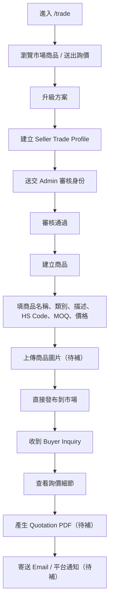
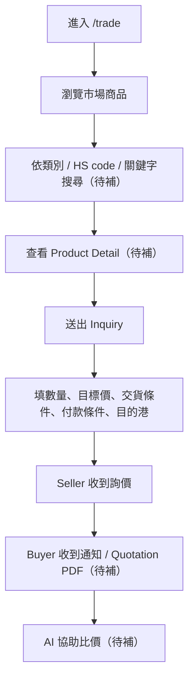

# 11 — Trade Module Delivery Plan

**Status**: Working Plan  
**Owner**: Grace Wu  
**Last Updated**: 2026-05-15

---

## 版本紀錄

| 版本 | 日期 | 變更內容 | 作者 |
|---|---|---|---|
| v0.1 | 2026-04-30 | 補 Trade module 交付計畫、Seller/Buyer flow、功能分期 | Codex |
| v0.2 | 2026-05-15 | 調整權限模型：所有登入用戶可市場瀏覽/詢價，seller 需升級+身份審核 | Codex |

---

## 1. 目前已完成

- Trade access gating（所有登入用戶可進市場；seller 功能需方案+身份審核）
- Trade profile（seller only）
- 商品建立、編輯、下架
- 市場商品列表
- Inquiry 建立與 sent / received 列表

---

## 2. 待補功能清單

### Phase A — 完整交易閉環最小版
- Product detail page
- Buyer / Seller detail page
- 類別樹 / HS code 搜尋
- 商品圖片上傳
- Admin 審核流程（seller 身份）

### Phase B — 對外溝通與正式報價
- Quotation PDF
- Email 通知
- Inquiry detail page
- Seller 報價回覆資料結構

### Phase C — 效率與規模化
- 批次 CSV 匯入
- AI 商品描述生成
- AI HS code 建議
- AI 比價 / quotation compare

---

## 3. 建議實作順序

1. Product detail page + Buyer / Seller detail page
2. 類別樹 / HS code 搜尋
3. 圖片上傳
4. Seller 身份審核流程
5. Quotation PDF
6. Email 通知
7. CSV 匯入
8. AI tools

原因：
- 先把核心資料展示與查找補齊，Seller / Buyer 才有實際操作價值
- PDF / Email 要建立在穩定的 inquiry/product/profile 資料基礎上
- AI tools 最後補，避免建立在不穩定欄位之上

---

## 4. Seller Flow

---

## 5. Buyer Flow

---

## 6. 功能拆解

### 6.1 Quotation PDF
- 新增 `Quotation` / `QuotationItem` 資料模型，或先由 `Inquiry + Product + Seller Profile` 動態生成
- 使用 `react-pdf` 產出
- 儲存位置：S3 / Supabase Storage
- 下載路由：`/api/trade/inquiries/:id/quotation.pdf`

### 6.2 Email 通知
- 事件：
  - inquiry sent -> seller
  - inquiry accepted / quotation ready -> buyer
- 使用 `Resend`
- 後續建議改 queue（BullMQ）非同步寄送

### 6.3 商品圖片上傳
- API:
  - `POST /api/trade/products/:id/images`
- 儲存：
  - S3 / Supabase Storage
- 需補：
  - thumbnail / large
  - 前端 preview

### 6.4 批次 CSV 匯入
- 路徑：
  - `POST /api/trade/products/bulk`
- 流程：
  - 下載模板 -> 上傳 -> 預覽 -> 匯入結果

### 6.5 類別樹 / HS code 搜尋
- 新增 `ProductCategory` seed
- API:
  - `GET /api/trade/categories`
  - `GET /api/trade/hs-codes/suggest`
- 商品列表加 query params:
  - `q`
  - `category`
  - `hs_code_prefix`

### 6.6 AI Tools
- `generate_product_description`
- `suggest_hs_code`
- `draft_inquiry`
- `compare_quotations`

### 6.7 Buyer / Seller Detail Page
- 頁面：
  - `/trade/products/[id]`
  - `/trade/sellers/[sellerId]`
  - `/trade/buyers/[buyerId]`（至少 seller 收到 inquiry 後可檢視）

### 6.8 Admin 審核
- 審核項目：
  - seller trade profile 身份
  - suspicious inquiry
- 商品不作為進市場前置審核；admin 保留商品總覽與人工 pause 能力
- Admin 頁面：
  - `/admin/trade/profiles`
  - `/admin/trade/products`

---

## 7. 建議下一批實作

**第一批**
- Product detail page
- Seller detail page
- 類別 / HS code 搜尋

**第二批**
- 圖片上傳
- Admin 審核

**第三批**
- Quotation PDF
- Email 通知

**第四批**
- CSV
- AI tools
